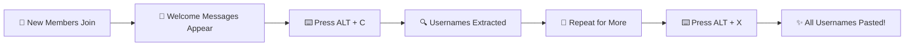

<div align="center">

# 🎉 Discord Welcome Assistant


### ⚡ Automate Your Discord Welcomes with OCR Magic ⚡

[](https://www.electronjs.org/)
[](https://www.python.org/)
[](https://github.com/tesseract-ocr/tesseract)

---

</div>

## 🌟 What It Does

This powerful desktop app monitors your Discord welcome channel and helps you greet new members instantly:

- 📸 **Auto-Capture** - Takes screenshots of Discord welcome messages
- 🔍 **Smart OCR** - Extracts usernames using advanced OCR technology
- 💾 **Memory Storage** - Stores unique usernames automatically
- ⚡ **Quick Paste** - Paste all collected usernames with @ mentions in one click

<div align="center">

### 🎯 Perfect for Discord Community Managers!

</div>

## 📋 Prerequisites

Before running this app, you need to install:

### 1️⃣ Node.js (v16 or higher)
> 🔗 Download from: https://nodejs.org/

### 2️⃣ Python (v3.8 or higher)
> 🔗 Download from: https://www.python.org/downloads/
> 
> ⚠️ **Important:** Check "Add Python to PATH" during installation

### 3️⃣ Tesseract OCR
> 🔗 Download from: https://github.com/UB-Mannheim/tesseract/wiki
> 
> 📁 Install to: `C:\Program Files\Tesseract-OCR\`
> 
> 💡 Or update the path in `python_backend/discord_username.py` if you install elsewhere

### 4️⃣ Python Dependencies
```cmd
pip install pytesseract pyautogui pyperclip pillow keyboard
```

## 🚀 Installation

### Step 1: Navigate to the app folder
```cmd
cd "discord bot/discord-welcome-app"
```

### Step 2: Install Node.js dependencies
```cmd
npm install
```

<div align="center">

✅ **Installation Complete!** You're ready to go!

</div>

## 🎮 How to Use

### 🟢 Start the app:
```cmd
npm start
```

### 📱 Open Discord and navigate to your welcome channel

### ⌨️ Hotkeys

<div align="center">

| Hotkey | Action | Description |
|--------|--------|-------------|
| `ALT + C` | 📸 **Capture** | Take screenshot and extract usernames |
| `ALT + X` | 📋 **Paste** | Paste all collected usernames with @ mentions |
| `CTRL + SHIFT + Q` | 🚪 **Quit** | Exit the program |

</div>

## 🔄 Workflow Example



<div align="center">

### 📝 Example Output:
`@username1 @username2 @username3 @username4`

</div>

## ✨ Features

<table>
<tr>
<td width="50%">

### 🧠 Smart Username Filtering
Ignores common false positives like "supporter", "everyone", "app"

### 📁 Screenshot Management
Automatically keeps only the last 10 screenshots

</td>
<td width="50%">

### 🚫 Duplicate Prevention
Won't add the same username twice

### 📊 Real-time Logs
See what's happening in the Electron window

</td>
</tr>
</table>

## 📸 Screenshots Location

> 📁 Screenshots are saved to: `D:\TimePass\discord bot\user_screenshots\`

💡 **Tip:** You can change this path in `python_backend/discord_username.py` (line 18)

## 🔧 Troubleshooting

<details>
<summary>❌ App won't start</summary>

- ✅ Make sure Python is installed and in your PATH
- ✅ Verify Tesseract is installed at `C:\Program Files\Tesseract-OCR\`
- ✅ Check that all Python dependencies are installed

</details>

<details>
<summary>🔍 No usernames detected</summary>

- ✅ Make sure Discord is visible on screen when pressing `ALT + C`
- ✅ Try adjusting the crop area in `discord_username.py` if your Discord layout is different
- ✅ Ensure welcome messages are clearly visible

</details>

<details>
<summary>⌨️ Hotkeys not working</summary>

- ✅ Make sure the app is running
- ✅ Try running the app as administrator
- ✅ Check if another app is using the same hotkeys

</details>

## 📦 Building Executable

To create a standalone `.exe` file:

```cmd
npm run build
```

> 📂 The executable will be in the `dist` folder.

---

## 📝 Notes

> 💡 The app captures the screen area where Discord welcome messages typically appear
> 
> 🎨 Works best with Discord in light or dark mode with default layout
> 
> 💾 Usernames are stored in memory and cleared when you restart the app

---

<div align="center">

## 🤝 Contributing

Found a bug? Have a feature request? Feel free to open an issue!

## ⭐ Show Your Support

If this project helped you, give it a ⭐️!

---

### Made with ❤️ for Discord Communities

[](https://discord.com)

---

## 📄 License

Free to use and modify for personal projects.

**Happy Welcoming! 🎉**

</div>
